# Point Salad
<table>
<tr>
<td>
  A mobile Point Salad board game built using React Native. A player can sign up or log in using email, Facebook or Google accounts. Game statistics including a player's highest score in history will be recorded, and players are allowed to change some personal info (including name and profile picture) in the profile page. The game includes some instructions that will be provided for users opening the game for the first time. The instructions can also be accessed whenever from the main game screen.
</td>
</tr>
</table>

## Gallery

### Landing Page
<table>
 <tr>
  <td>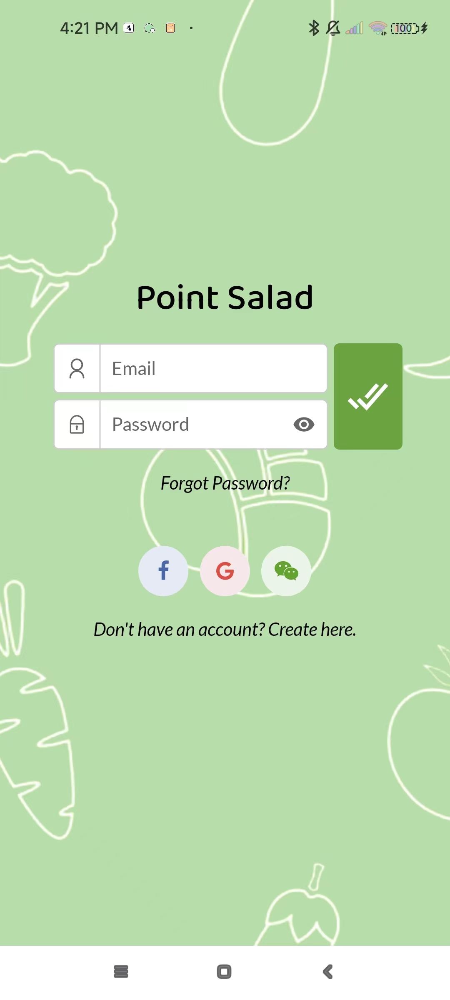</td>
  <td>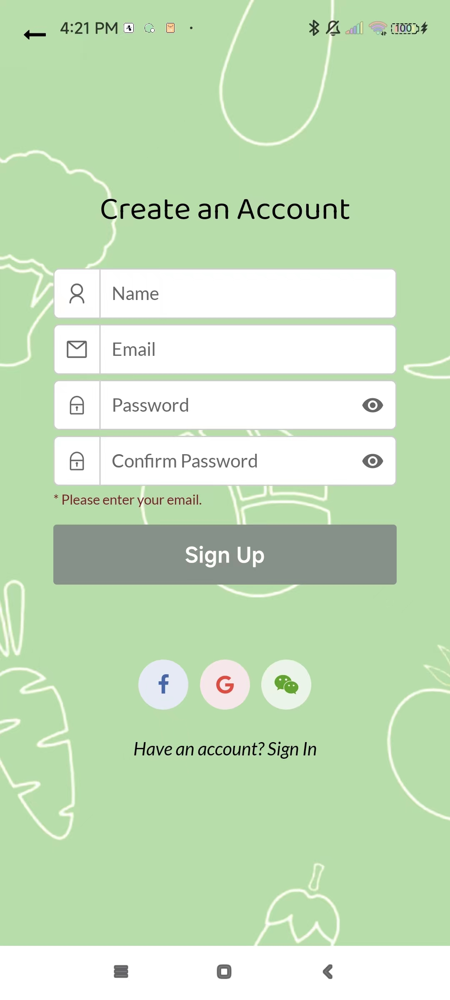</td>
  <td>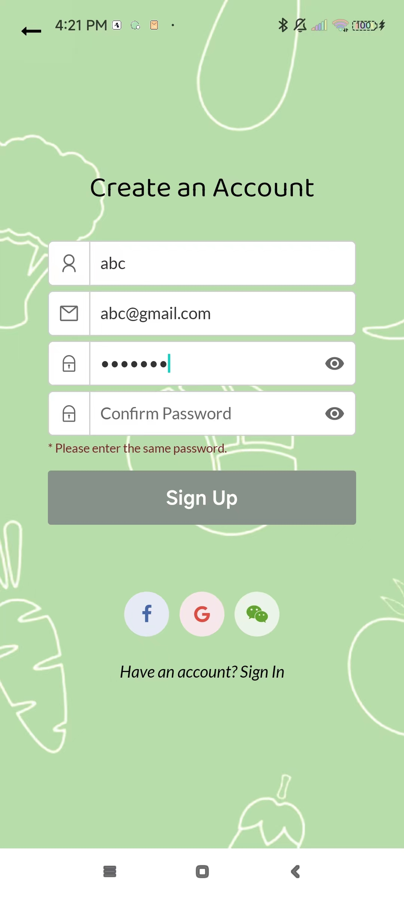</td>
  <td>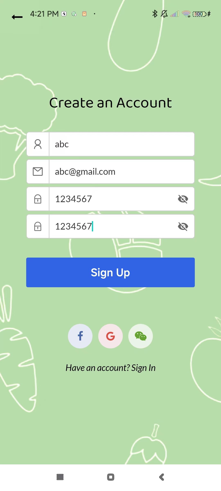</td>
 </tr>
</table>

### Instructions Slider
<table>
 <tr>
  <td>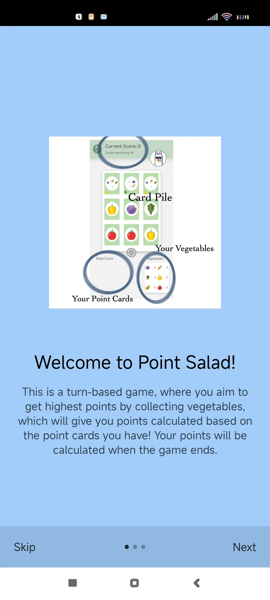</td>
  <td>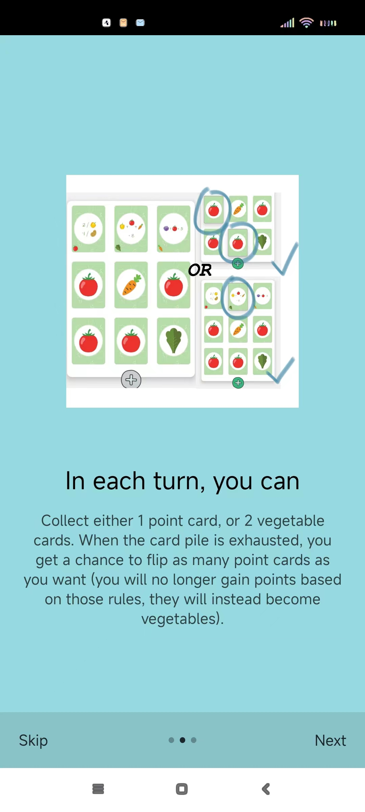</td>
  <td>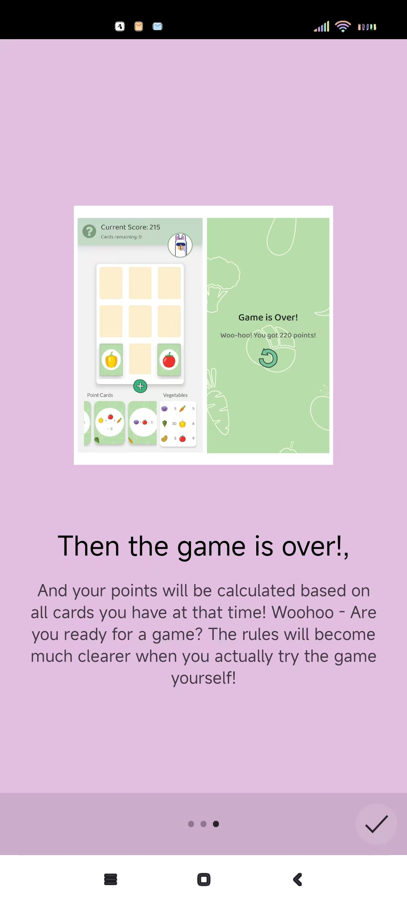</td>
 </tr>
</table>

### Main Game Screen
<table>
 <tr>
  <td>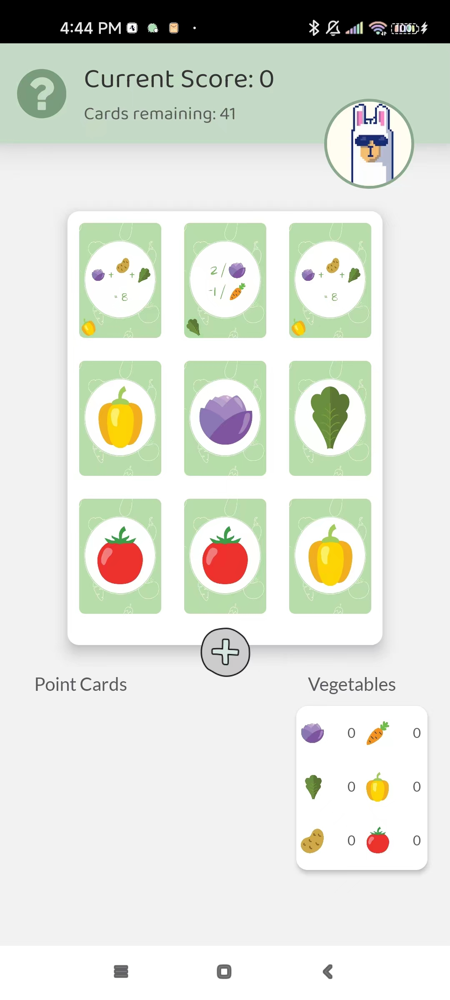</td>
  <td>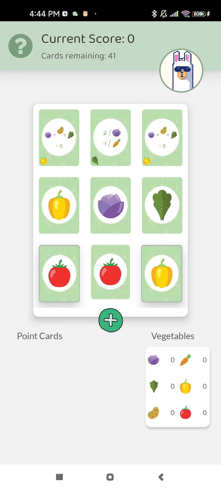</td>
  <td>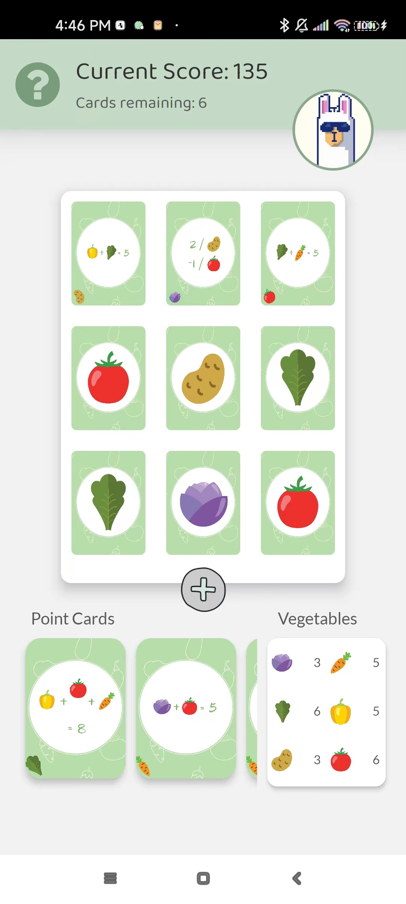</td>
 </tr>
 <tr>
  <td>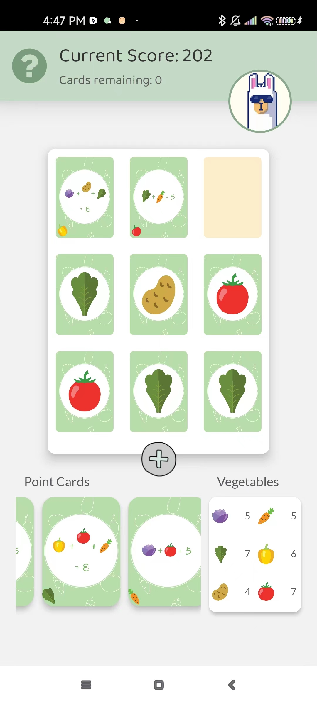</td>
  <td>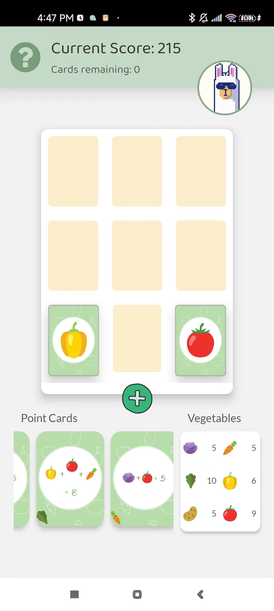</td>
  <td>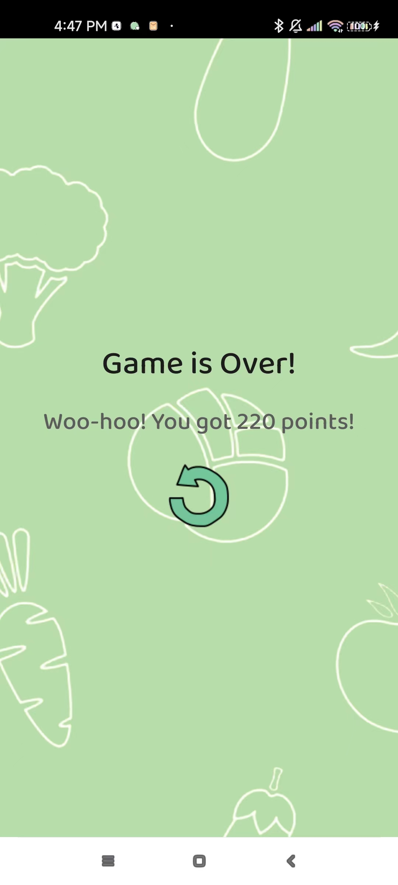</td>
 </tr>
</table>

### Profile Page
<table>
 <tr>
  <td>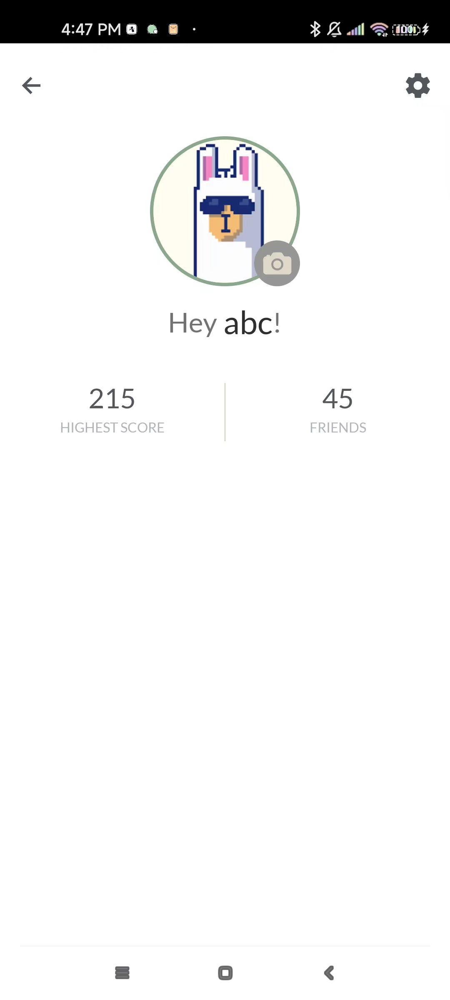</td>
  <td>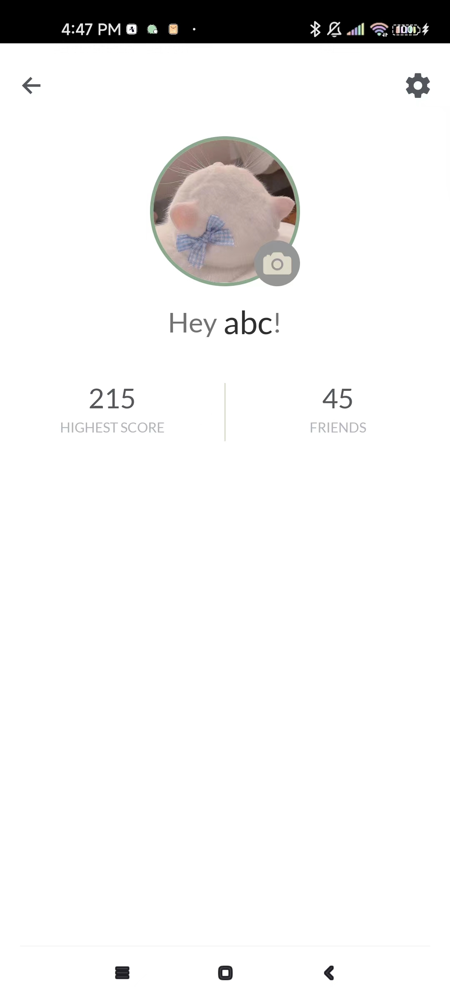</td>
  <td>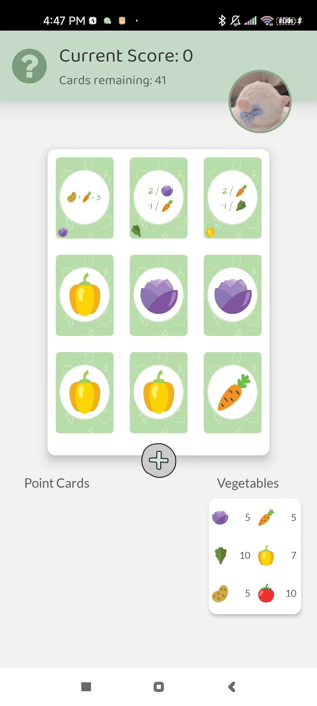</td>
 </tr>
</table>  
  
  
  
## Development
This react native project is built with help of the [Expo](https://expo.dev) client. To get started,
* Run either (`npm start`) or (`expo start`)
* Follow the instructions to launch the app on an Android/iOS emulator or a real device. 

## Built with 

- [React Native](https://reactnative.dev) - Supports building native mobile apps using the React JavasScript library.
- [Firebase Authentication](https://firebase.google.com/docs/auth) - Allows easy identity verification for email/password combinations, and supports signing up using Facebook or Google accounts.
- [Cloud Firestore](https://firebase.google.com/docs/firestore) - To store user profiles and fetch real-time game updates.
- [Cloud Storage for Firebase](https://firebase.google.com/docs/storage) - To store card images, and users' uploaded profile pictures. 

## To-do
* Modify game logic
  * When all the cards are drawn, allow users to flip point cards
* Test the UI on different devices (** ios)
* Implement settings screen
  * Change user name
  
## To-do (?)
* Implement "friends" functionality
* Support multi-user games
